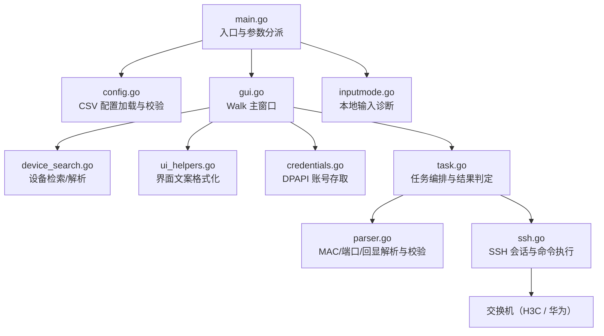
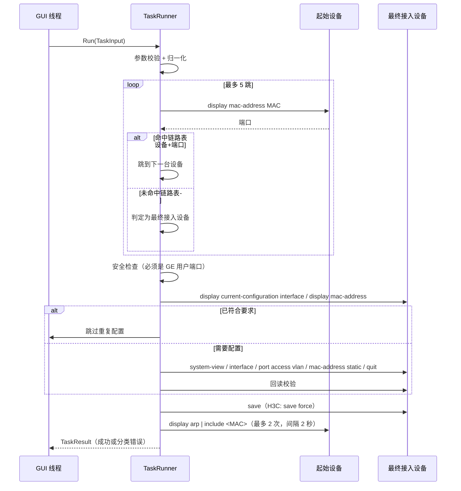

# 调网通 AutoNet 技术文档

| 项目 | 说明 |
| --- | --- |
| 文档版本 | v1.1（2026-10-08，随 `ebf4af0` 修复更新） |
| 适用源码 | `main` 分支 `ebf4af0` 及以后 |
| 目标读者 | 维护者、二次开发者、现场验收与审计人员 |
| 配套文档 | [README.md](../README.md)（使用与构建）、[AutoNet使用说明.docx](AutoNet使用说明.docx)（现场操作） |

---

## 1. 项目概述

调网通（AutoNet）是面向 **Windows 7 SP1 x64** 的交换机调网工具。现场给定终端的 MAC 地址和目标 VLAN 后，工具沿预先配置好的交换机链路逐跳查询 MAC 地址表，定位终端实际接入的交换机与端口；若该端口 VLAN 与静态 MAC 已符合要求则跳过重复配置，否则下发配置、回读校验、保存配置，最后回起始设备检查 ARP 确认终端 IP。

### 1.1 设计目标

1. **现场零依赖**：单个 exe，不安装运行库、不需要 .NET/Python/VC 运行时，Win7 SP1 x64 双击即用。
2. **确定性操作范围**：只改一台设备（最终接入设备）的一个用户端口，其余设备仅做只读查询。
3. **可追溯**：每次任务生成独立日志（含原始设备返回），日志不记录密码；exe 内嵌源码提交号。
4. **失败要明确**：区分"配置校验失败"、"保存未确认"、"ARP 验证失败"，避免把"命令没报错"当成成功。

### 1.2 非目标

- 不做全网扫描或自动发现拓扑（链路依赖人工维护的 CSV）。
- 不做批量/并发调网（一次一个终端、串行执行）。
- 不替代业务系统或互联网连通性测试（"网络已调通"仅指本工具的配置、保存、ARP 检查通过）。
- 不覆盖非 GE 用户端口（`XGE`、`Eth-Trunk`、聚合口等不执行调网）。

---

## 2. 运行环境与技术选型

| 维度 | 选择 | 原因 |
| --- | --- | --- |
| 语言 | Go 1.20.14（严格锁定） | Go 1.21+ 已放弃 Windows 7 支持；1.20 是兼容 Win7 的最后一条主线 |
| 目标平台 | `GOOS=windows GOARCH=amd64 CGO_ENABLED=0` | 纯静态单文件，无 C 运行时依赖 |
| GUI | `github.com/lxn/walk` | 原生 Win32 控件封装，Win7 可用，无需额外运行库 |
| SSH | `golang.org/x/crypto/ssh` | 纯 Go 实现，便于显式控制算法协商列表 |
| 凭据加密 | `golang.org/x/sys/windows`（DPAPI） | 系统自带，无第三方依赖，Win7 可用 |
| 文本编码 | `golang.org/x/text`（UTF-16 / GB18030） | 现场 CSV 常由 Excel 另存为，编码不统一 |
| 资源嵌入 | `rsrc.syso`（已入库） | 免去现场安装 `rsrc` 工具，Go 构建时直接嵌入 manifest 与图标 |

`go.mod` 声明的直接依赖：`lxn/walk`、`golang.org/x/crypto`、`golang.org/x/sys`、`golang.org/x/text`；间接依赖 `lxn/win`、`gopkg.in/Knetic/govaluate.v3`。仓库不使用 `vendor/`，依赖版本由 `go.mod` 与 `go.sum` 固定。

### 2.1 Win7 相关的两处实现细节

1. **manifest 嵌入**：`AutoNet.manifest` 声明依赖 `Microsoft.Windows.Common-Controls 6.0.0.0` 并开启 `dpiAware`，使 Win7 上使用主题化控件而非 Win95 观感。该 manifest 已编译进 `rsrc.syso`，随二进制分发，现场无需附带 manifest 文件。
2. **日志换行**：Win7 记事本对纯 LF 的多行文本显示为一行，因此日志写入时统一转成 CRLF（`task.go` 中的 `windowsLogWriter`）。

---

## 3. 系统架构

### 3.1 分层



### 3.2 模块职责

| 文件 | 职责 | 关键导出 |
| --- | --- | --- |
| `main.go` | 解析启动参数，定位 exe 目录，加载配置，启动 GUI | `main` |
| `config.go` | 读取两台 CSV、处理编码、做结构与引用校验 | `LoadConfig`、`Device`、`AppConfig` |
| `device_search.go` | 设备模糊检索与唯一性解析 | `SearchDevices`、`ResolveDevice`、`DeviceLabel` |
| `parser.go` | MAC/端口归一化、MAC 表与 ARP 回显解析、配置回读校验 | `NormalizeMAC`、`ParseMACPort`、`VerifyPortConfig`、`SaveSucceeded` |
| `ssh.go` | SSH 连接、算法协商、PTY Shell、命令下发、输出同步与提示符判定 | `SSHClient.RunCommands`、`SSHClient.RunCommandsContext`、`PrepareCredentials` |
| `task.go` | 六阶段调网流程、取消检查点、日志落盘、结果与错误分类 | `TaskRunner.Run`、`NewTaskRunnerContext`、`TaskInput`、`TaskResult` |
| `gui.go` | 主窗口、参数校验、后台任务、UI 线程同步与退出清理 | `RunGUI`、`readLogPreview` |
| `ui_helpers.go` | 运行记录与结果文案格式化 | `FormatUIMessage`、`FormatTaskStart`、`FormatTaskResult` |
| `credentials.go` | 账号列表的 DPAPI 加解密与落盘 | `LoadCredentials`、`SaveCredentials` |
| `inputmode.go` | 不联网的本地输入诊断 | `RunInputTest` |
| `cmd/walk-smoke/main.go` | Walk GUI 启动自检（独立可执行文件） | `main` |
| `tools/make_icon.go` | 生成多尺寸 `assets/autonet.ico`（`//go:build ignore`） | `main` |

### 3.3 并发模型与取消

- GUI 在主线程运行 Walk 消息循环。
- `RunGUI` 创建 `context.WithCancel`，并通过 `NewTaskRunnerContext` 把该上下文交给任务执行器；命令下发与每一处等待都会检查它。
- 点击"开始调网"后，任务在**独立 goroutine** 中执行，避免阻塞界面；协程结束时关闭 `taskDone` 通道。
- 任务通过 `emit` 回调输出进度，回调经 `syncUI` 包装：先取 `uiMu` 锁，检查 `closing` 原子标志，再用 `mw.Synchronize` 切回 UI 线程。窗口开始关闭后，所有回调直接丢弃，避免向已销毁的控件写入。
- 关闭窗口不再被拦截：`Closing` 事件置位 `closing`、停止筛选定时器、`cancel()` 上下文并释放日志窗口；`mw.Run()` 返回后再等 `taskDone` 最多 1 秒，让工作协程关闭 SSH 连接并写完日志，但绝不死等。
- 界面没有独立的"停止"按钮，取消只在检查点生效：每条命令发送前、等待回显的 100 ms 轮询、ARP 重试的等待。正在传输的单条命令不会被中途打断，但取消后不再进入下一步。
- 单进程同一时刻只执行一个任务；SSH 客户端不做连接池复用（每次任务内每台设备独立建连）。

---

## 4. 配置子系统

### 4.1 数据模型

```go
type Device struct { ID, Name, IP, Type string }

type AppConfig struct {
    Devices map[string]Device  // key: 大写设备 ID
    Links   map[string]string  // key: "设备ID|归一化端口"，value: 下一跳设备 ID
}
```

链路用 `设备ID|端口` 作为键，天然避免同一设备同一端口出现两条不同链路；解析阶段会检测并报错冲突。

### 4.2 文件位置

`main.go` 以 `os.Executable()` 所在目录为基准，读取同目录的 `devices.csv`、`links.csv`，并在同目录创建 `logs/`。程序不依赖当前工作目录，从资源管理器双击、命令行、快捷方式启动行为一致。

### 4.3 编码处理

`openCSV` 按以下顺序判定：

1. 文件头为 `FF FE` 或 `FE FF` → 按 UTF-16 解码（依据 BOM 判定字节序）。
2. 否则若不是合法 UTF-8 → 按 GB18030 解码（兼容 GBK）。
3. 结果为非法或包含替换字符 `U+FFFD` → 直接报错，提示另存为 UTF-8 CSV，避免把乱码设备名带进后续流程。
4. 解析前剥离 UTF-8 BOM；每个表头字段再单独剥离残留 BOM。

CSV 读取设置 `TrimLeadingSpace = true`、`FieldsPerRecord = -1`（允许每行字段数不同），字段值统一 `TrimSpace`。

### 4.4 devices.csv

表头要求 `id,ip,type`（另兼容可选的 `name`）。校验规则：

- 整行 `id` 与 `ip` 均为空 → 跳过（容忍 Excel 产生的空行）。
- `id` 统一转大写；`ip` 必须通过 `net.ParseIP`，并规范化为标准字符串形式。
- `type` 统一转小写；空 `type` 报错。
- 设备 ID 重复、IP 重复均报错，并在错误信息中给出冲突双方。
- 文件内没有任何设备 → 报错。

### 4.5 links.csv

表头要求 `port` 加二选一：新版 `input_ip,output_ip`，或旧版 `device,next_device`（兼容历史配置）。

- `port` 经 `NormalizePort` 归一化（去空格、转大写、`GigabitEthernet` → `GE`）。
- 新版用 IP 反查设备 ID，IP 非法或不在设备表中的行直接报错。
- 链路两端都必须存在于设备表，否则报"拓扑配置错误"。
- 端口为空、同键冲突均报错。

---

## 5. 设备检索

`SearchDevices` 对查询串做小写包含匹配，匹配对象为设备 ID、IP 和展示标签 `ID (IP)`，结果排序后返回，用于下拉列表实时筛选；GUI 再用 `sameDeviceIDs` 比较新旧命中集合，集合未变时不重建列表。

`ResolveDevice` 用于"开始调网"时确定起始设备，优先级为：

1. 设备 ID（忽略大小写）、完整 IP、展示标签三者之一完全相等；
2. 否则做模糊检索，**唯一命中**才接受；
3. 命中 0 条或多条时给出明确提示（"未找到设备" / "请从匹配列表选择"）。

这样既支持现场输入不完整的 IP（如只输最后一段），又不会误选设备。

---

## 6. 协议解析与校验

### 6.1 MAC 归一化

`NormalizeMAC` 删除 `-`、`:`、`.` 和空白字符，要求恰好 12 个十六进制字符，输出 `xxxx-xxxx-xxxx` 小写形式。上层（GUI、任务、解析）统一使用该形式做比对，避免同一 MAC 的多种写法导致匹配失败。

### 6.2 端口归一化

| 场景 | 规则 |
| --- | --- |
| `NormalizePort` | 去空格 → 转大写 → 首个 `GIGABITETHERNET` 替换为 `GE`，用于链路表与配置比对 |
| `canonicalPort` | 从设备回显中提取端口时，`GigabitEthernet` 保留原样，其他（`XGE`、`GE`）转大写 |
| `HuaweiInterfaceName` | 仅接受 `GE`/`GigabitEthernet` 加数字端口号，统一生成 `GigabitEthernet x/y/z`；其他类型直接报错 |

端口正则同时匹配 `XGE`、`GE`、`GigabitEthernet` 加数字端口号形式，因此链路追踪可以穿过 `XGE` 上行口，但**配置下发只允许**落到 GE 用户端口。

### 6.3 MAC 表解析

`ParseMACPort` 逐行查找包含目标 MAC 的行，取该行第一个端口串作为结果：

- 找到 MAC 但该行没有端口 → `ErrPortNotFound`（无法从 MAC 表解析端口）；
- 整段回显没有该 MAC → `ErrMACNotFound`（MAC 未找到）。

区分这两类错误，现场才能判断是"MAC 不在这个设备上"还是"设备输出格式不认识"。

### 6.4 配置回读校验

`VerifyPortConfig` 是"改配置是否真的生效"的唯一判据，同时要求两份回显都成立：

接口配置回显（`display current-configuration interface ...`）：

1. 存在 `interface <目标端口>` 段；
2. 存在 `port access vlan <目标VLAN>`；若目标 VLAN 为 1 且回显未显式出现该行，按设备默认值放行；
3. 未出现 `port link-type trunk` / `port link-type hybrid`（避免把 Trunk 口当成接入口）。

静态 MAC 表回显（`display mac-address <mac>`）：

4. 存在字段为 `MAC / VLAN / 端口` 且 VLAN 等于目标值的行，端口与目标端口归一化后相等；
5. 该行包含 `static` 或 `S` 标记（确认是静态表项而非动态学习）。

任一条不成立即判定失败。代码注释明确说明：设备返回"MAC address already exists"之类的提示**不足以**作为成功证据。

### 6.5 CLI 结果判定

- `HasCLIError`：回显中出现 `error`、`unrecognized`、`incomplete`、`wrong`、`failed`、`failure` 任一关键词即视为命令出错。
- `SaveSucceeded`：无错误关键词，且同时包含 `success` 与（`saved` 或 `saving` 或 `save the configuration`）。

两者都是关键词判定，属于保守策略：宁可判失败让现场看日志，也不把未确认的保存当作成功（详见第 12 节风险）。

### 6.6 ARP 解析

`FindARPEntry` 跳过包含 `display arp` 的命令回显行，在含目标 MAC 的行里取第一个合法 IPv4 地址，且该行不含错误关键词。找到即返回终端 IP。

---

## 7. SSH 会话层

### 7.1 超时参数

| 参数 | 默认值 | 说明 |
| --- | --- | --- |
| `ConnectTimeout` | 7 秒 | TCP 连接与 SSH 握手、认证 |
| `CommandTimeout` | 10 秒 | 单条查询/配置命令的等待上限 |
| 保存命令 | 60 秒 | 命令以 `save` 开头时自动放宽（整份运行配置写盘较慢） |

超时通过 `conn.SetDeadline` 施加在底层 TCP 连接上，命令前后都会重设，避免长任务被早期 deadline 提前打断。`RunCommandsContext` 额外接收 `context.Context`：上下文取消时，连接会被立即关闭，等待中的读操作随之返回，不必等满超时。`ConnectTimeout` 同时作为 `net.Dialer` 的拨号超时；取消不依赖 deadline，而是由 `ctx` 直接关闭底层连接，两者互不影响。

### 7.2 算法协商

`ssh.go` 显式给出 KEX 与加密算法列表，**现代算法在前、旧算法兜底**，使新设备仍协商现代算法，只支持旧算法的老交换机也能握手：

- KEX：`curve25519-sha256`、`ecdh-sha2-nistp256/384/521`、`diffie-hellman-group14-sha256`、`group16-sha512`、`group-exchange-sha256`，兜底 `group14-sha1`、`group-exchange-sha1`、`group1-sha1`。
- 加密：`aes128/256-gcm`、`chacha20-poly1305`、`aes128/192/256-ctr`，兜底 `aes128-cbc`、`3des-cbc`。

认证方式同时提供 `password` 与 `keyboard-interactive`（用同一密码回答所有提示），覆盖拒绝 password 方式但接受交互式认证的机型。

> 主机密钥校验使用 `ssh.InsecureIgnoreHostKey()`，即不校验，仅适用于可信管理网络（见第 12 节）。

### 7.3 会话流程

1. `net.Dialer.DialContext` 建立 TCP 连接，`ssh.NewClientConn` 完成握手与认证；同时启动一个观察协程，上下文取消时直接关闭该连接。
2. 新建 session，分别取得 stdin/stdout/stderr，stdout 与 stderr 都并入同一个 `lockedBuffer`。
3. 请求 `vt100` PTY（40 行 × 120 列，`ECHO` 开启），启动 Shell。
4. 等待首屏 banner 与提示符。
5. **关闭分页**：华为执行 `screen-length 0 temporary`，H3C 执行 `screen-length disable`；若回显报错则交换两条命令重试一次。分页是"回显被 `---- More ----` 截断"的根因，必须先行处理。
6. 逐条下发命令，每条命令只截取本次新增的输出片段（`StringFrom(before)`）返回。

等待初始提示符、关闭分页、备用分页命令这几步失败时，错误信息会指明具体阶段（如"SSH已登录，等待初始提示符失败"），便于区分"登录不上"和"登录后设备没给提示符"。

### 7.4 输出同步与提示符判定

设备回显是异步、分包、可能延迟到达的，`waitCommandOutputContext` 用 100 ms 定时器轮询实现稳定判定：

- 每次轮询先检查上下文，取消立即返回；缓冲区长度变化时刷新"稳定时刻"。
- 匹配前先用 `cleanTerminalText` 把累积输出渲染成"可见文本"：按行处理 `\r`、`\n`、`\b`，丢弃控制字符，并解释常见转义序列——CSI `K`（`0`/`1`/`2` 三种擦除到行尾/行首/整行）、OSC（`ESC ]` 至 `BEL` 或 `ESC \`）、字符集切换（`ESC (`、`ESC )`）。**未结束的转义序列**会原样保留为尾部 `ESC`，因此被 SSH 分包切断的半截提示符不会被误判为完整。
- 取可见文本的最后一行，用**整行锚定**正则判断提示符：`^(?:<名称>|\[视图\])$`。因此 `<SW>display mac-address ...` 这类"提示符 + 命令回显"不会被当成结束，`[y/n]` 也被显式排除。
- 同时满足"命令已发出 ≥ 300 ms""最后一行是完整提示符""内容已稳定 ≥ 150 ms"三个条件才认为本轮结束。
- 保存命令额外处理交互：最后一行出现 `[y/n]`、`(y/n)` 自动回 `y`；出现 `file name`、`filename unchanged` 自动回车确认。同一长度位置只应答一次，避免重复输入；取消时这些应答也立即停止。
- 超时错误会附带缓冲区**末尾 256 字节原始内容**（转义后打印），便于现场判断设备停在哪一步。

以上行为由 `TestShellDoesNotFinishOnEchoOrDelayedOutput`、`TestSaveConfirmation`、`TestTerminalPromptCompatibility`、`TestPromptMustBeWholeLine`、`TestSplitEscapeAndFreshCommandOutput`、`TestCancellationStopsPromptWaitAndSaveReply`、`TestCancellationInterruptsActivePromptWait` 覆盖。

---

## 8. 任务执行流程

### 8.1 六阶段



1. **参数校验**：MAC 归一化、VLAN 范围 1–4094、用户名密码非空（均先 `TrimSpace`）、起始设备存在。
2. **逐跳追踪**（`trace`）：每跳执行 `display mac-address <MAC>`，解析端口；若 `设备ID|端口` 命中链路表则跳下一台，否则当前设备即最终接入设备。上限 5 跳（`maxHops`），超限报错。设备类型非 `h3c`/`huawei` 直接拒绝。
3. **安全检查**：最终端口必须是 GE/GigabitEthernet 形式，否则终止（不保存、不配置）。
4. **现有配置检查与配置下发**：先回读一次；若 `VerifyPortConfig` 通过则记为"网络已调通"并跳过下发；否则下发 `system-view` → `interface GigabitEthernet x/y/z` → `port access vlan <VLAN>` → `mac-address static <MAC> vlan <VLAN>` → `quit` ×2，然后**再次回读校验**，不通过则报"配置校验失败"且不保存。
5. **保存**：华为 `save`，H3C `save force`；必须收到成功确认，否则报"配置已生效，但保存失败或未收到保存成功确认"。
6. **ARP 验证**：回到**起始设备**执行 `display arp | include <MAC>`，最多 2 次、每次前等待 2 秒（由 `pause` 实现，可被取消立即打断）；命中则返回终端 IP，两次都失败报"配置已校验并保存，但 ARP 验证失败"。

所有命令都经 `r.execute` 下发、所有等待都经 `r.pause`：两者先检查上下文，取消后在最近的检查点返回 `context.Canceled`；命令失败时的错误会带上底层原因（如 `设备 192.0.2.30 执行失败：context canceled`），并写入日志。

### 8.2 幂等性

第 4 阶段的"先校验、后下发"使重复执行天然幂等：同一终端再次调网时不会重复下命令，但仍会执行保存与 ARP 验证，结果文案为"网络已调通"（`TaskResult.AlreadyConfigured`）。该行为由 `TestRepeatedTaskSkipsConfiguration` 覆盖。

### 8.3 日志

- 目录：`<exe 目录>/logs/`，文件名 `YYYYMMDD_HHMMSS.mmm.log`，创建时用 `O_EXCL` 防重名。
- 内容：任务参数、每跳设备与命令、设备**原始返回**、技术错误、校验结论、ARP 结果。
- 不记录密码；写入时统一 CRLF 以适配 Win7 记事本。
- GUI 在日志创建后启用"查看日志"按钮，点击后在**程序内对话框**（800×600 只读文本框）打开当前任务日志，由 `readLogPreview` 读取，最多预览前 1 MB，超出部分提示"完整内容在日志文件中"。
- 日志包含现场设备信息，**不入库**（`.gitignore` 忽略 `logs/` 与 `*.log`）。

### 8.4 结果分类

| 文案 | 触发条件 |
| --- | --- |
| 调网成功 | 本次下发了配置，且回读校验、保存确认、ARP 检查全部通过 |
| 网络已调通 | 原配置已符合要求，跳过下发；保存与 ARP 检查通过 |
| 超过最大链路深度5 | 5 跳后仍在链路表中 |
| MAC未找到 | 某跳设备的 MAC 表无该 MAC |
| 无法从MAC表解析端口 | 找到 MAC 行但无法解析端口（机型输出不兼容） |
| 设备 `<IP>` 执行失败：`<原因>` | TCP/握手/认证失败、等待提示符失败、命令超时，或设备类型不支持 |
| VLAN配置失败 | 配置命令返回错误 |
| 配置校验失败 | 回读的 VLAN 或静态 MAC 与目标不一致，**未保存** |
| 保存失败或未收到保存成功确认 | 保存命令报错或未匹配成功关键词 |
| 配置已校验并保存，但 ARP 验证失败 | 保存成功但两次 ARP 均未命中 |
| （取消）`context canceled` | 任务运行中关闭窗口触发取消；概要栏显示"未完成 · 请查看运行记录" |
| 设备类型暂不支持 | `type` 不是 `h3c` / `huawei` |

---

## 9. GUI 层

- 采用 Walk 声明式 API 构建：标题栏图标 + 参数区（设备下拉、MAC、VLAN）+ 登录区（用户、密码、折叠的账号管理）+ 结果区（概要标签、运行记录文本框、查看日志按钮）。
- 窗口 680×640，最小 600×540，背景 `RGB(245,247,250)`，字体微软雅黑 10pt。
- 窗口图标从资源 ID **2** 加载（`rsrc` 保留 ID 1 给 manifest、ID 2 给第一个图标组），尺寸 48×48。
- 设备下拉框可编辑：`TextChanged` 触发筛选，输入后经 150 ms 防抖（`time.AfterFunc`）执行；`filterGeneration` 递增序号用于丢弃过期回调，`updatingDevices` 标志位避免回调递归。若新结果与当前列表一致（`sameDeviceIDs`），则不重建模型，避免界面抖动与无谓重排。
- **光标与重排处理**：重建候选列表期间用 `mw.SetSuspended(true)` 挂起重绘，更新文本与选区后再恢复，并在布局入队后补设一次选区——取代了早期依赖 `SizeChanged` 反复纠正插入符的方案。
- 账号管理默认折叠，展开后支持填入/保存；同名账号覆盖。账号文件在后台 goroutine 中通过 DPAPI 读取，读取完成前"已存账号"按钮处于禁用状态，避免 DPAPI 等待阻塞窗口创建。
- 输入校验在点击"开始调网"时完成（VLAN 1–4094、MAC 12 位十六进制、用户名密码非空、起始设备可解析），错误用 `MsgBox` 提示，不启动任务。
- 任务运行期间禁用"开始调网""重载 CSV"；关闭窗口即取消任务并退出（见 3.3），不再拦截关闭。

---

## 10. 安全设计

### 10.1 账号存储

`credentials.dat` 与 exe 同目录，内容为 `[]SavedCredential` 的 JSON 经 **DPAPI** 加密后的字节（`CryptProtectData` / `CryptUnprotectData`，标志 `CRYPTPROTECT_UI_FORBIDDEN`），文件权限 `0600`。

- 加密密钥绑定当前 Windows 用户，换电脑或换用户后无法解密，需重新保存。
- 无主密码、无权限弹窗、无额外服务或运行库依赖，Win7 可用。
- 读取失败（文件损坏或换了用户）不阻断启动，界面提示需重新保存账号。

### 10.2 凭据传递

`PrepareCredentials` 统一做 `TrimSpace`（去除粘贴带入的首尾空白与换行），并同时被 GUI 任务路径与本地输入诊断使用，保证两条路径行为一致。

### 10.3 不入库清单

`.gitignore` 排除：`.tools/`、`dist/`、`*.exe`（仅 `release/AutoNet.exe` 例外）、`*.zip`、根目录 `devices.csv`、`links.csv`、`credentials.dat`、`logs/`、`*.log`、`.env*`。现场地址、账号密文、设备原始回显都不进版本库。

---

## 11. 构建、测试与发布

### 11.1 build.bat

1. 优先使用项目内 `.tools\go\bin\go.exe`，否则用 PATH 中的 `go`；
2. 严格校验 `go version` 输出包含 `go1.20.14 `，不匹配直接失败（防止误用新版 Go 导致产物不支持 Win7）；
3. `go test ./...`；
4. 生成三个产物：

| 产物 | 命令差异 | 用途 |
| --- | --- | --- |
| `dist\AutoNet.exe` | `-ldflags="-s -w -H windowsgui"` | 正式 GUI 版 |
| `dist\AutoNet-debug.exe` | `-ldflags="-s -w"`（不加 `-H windowsgui`） | 控制台版，CMD 会等待，stdin 可用，供诊断模式使用 |
| `dist\walk-smoke.exe` | 同 GUI 版，编译 `.\cmd\walk-smoke` | 仅验证 Walk 界面能否启动 |

三个构建都带 `-trimpath`。脚本还会在缺失时把示例 CSV 复制到 `dist\`（已有现场 CSV 不会被覆盖），并复制 `README.txt`。

手工等价命令：

```bat
set GOOS=windows
set GOARCH=amd64
set CGO_ENABLED=0
go test ./...
go build -trimpath -ldflags="-s -w -H windowsgui" -o dist\AutoNet.exe .
```

### 11.2 资源与图标

- `rsrc.syso`（根目录）与 `cmd\walk-smoke\rsrc.syso` 已入库，Go 构建时自动嵌入。
- 图标由 `go run tools/make_icon.go` 生成：16/24/32/48/64/128 六种尺寸，4×4 超采样抗锯齿，输出 `assets/autonet.ico`。
- 修改 manifest 后需要重新生成资源：

```bat
go run tools/make_icon.go
rsrc -arch amd64 -manifest AutoNet.manifest -ico assets/autonet.ico -o rsrc.syso
rsrc -arch amd64 -manifest AutoNet.manifest -o cmd\walk-smoke\rsrc.syso
```

### 11.3 测试

`go test ./...` 覆盖 7 个测试文件、28 个用例，本地约 10 秒（`ok autonet`）：

| 测试文件 | 覆盖内容 |
| --- | --- |
| `config_test.go` | CSV 多编码解析（UTF-8/GB18030/UTF-16）、账号加解密往返 |
| `parser_test.go` | MAC 归一化、MAC 表端口解析、ARP 忽略命令回显、华为接口名安全限制 |
| `ssh_test.go` | 算法列表保留旧算法、回显/延迟输出不误判结束、保存确认、提示符兼容与整行锚定、转义序列分包、取消时停止提示符等待与保存应答 |
| `task_test.go` | 完整任务校验流程（用假 Runner）、拓扑逐跳追踪、取消后不再跳下一台设备、取消可打断 ARP 重试等待 |
| `inputmode_test.go` | 凭据裁剪、明文/安全两种诊断输出 |
| `ui_helpers_test.go` | 内嵌窗口图标可加载、界面文案格式化、日志文件名上报、结果文案 |
| `update_test.go` | IP/链路配置校验（合法、未知 IP、IP 重复、缺字段、链路冲突五个场景）、设备检索与唯一解析、重复任务跳过配置（文件名沿用早期版本） |

`ebf4af0` 新增的 7 个用例：

- `TestTerminalPromptCompatibility`（`ssh_test.go`）：横幅、ANSI 颜色、`ESC[K`、OSC 标题、退格等原始字节下仍能识别提示符。
- `TestPromptMustBeWholeLine`（`ssh_test.go`）：`<SW>display …` 回显行、`[Y/N]`、普通方括号文本不被当作提示符。
- `TestSplitEscapeAndFreshCommandOutput`（`ssh_test.go`）：转义序列分两次到达时必须等整段结束才判定完成，且不复用旧提示符。
- `TestCancellationStopsPromptWaitAndSaveReply`（`ssh_test.go`）：取消后等待立即返回 `context.Canceled`，且不再向设备补发确认字符。
- `TestCancellationInterruptsActivePromptWait`（`ssh_test.go`）：正在轮询等待时取消，等待立即结束。
- `TestCancelStopsNextHop`（`task_test.go`）：取消后不再发起下一跳查询。
- `TestCancelInterruptsARPRetryDelay`（`task_test.go`）：ARP 重试的 2 秒间隔可被取消立即打断。

任务与 SSH 层通过 `TaskRunner.RunCommands` 注入假实现测试；取消相关用例按生产同样的方式设置 `TaskRunner.Context`，ARP 等待可用 `Sleep` 注入替代，因此单元测试**不联网、不接触真实交换机**。

### 11.4 发布与可追溯

- `release/AutoNet.exe`：已编译的正式版；`release/SHA256SUMS.txt`：对应 SHA-256。
- 构建在 git 仓库内进行，Go 会把 `vcs.revision`、`vcs.time` 写进二进制，可用 `go version -m release\AutoNet.exe` 核对产物与提交号是否一致。
- `dist/` 为本地构建目录，不入库；对外分发用 `release/` 或现场自行构建。

---

## 12. 已知限制与风险

| 限制/风险 | 影响 | 现有缓解 | 建议 |
| --- | --- | --- | --- |
| 仅允许在 GE/GigabitEthernet 端口配置 | XGE、Eth-Trunk、聚合口终端无法自动调网 | 追踪阶段允许经过此类端口，配置前做端口类型检查并明确报错 | 现场手工处理，或后续扩展端口白名单 |
| 不校验 SSH 主机密钥 | 中间人可截获账号密码 | 仅限可信管理网络使用（README 已声明） | 如需加固，可增加首次连接指纹确认与 known_hosts |
| CLI 结果依赖关键词判定 | 回显中出现 `error`/`failed` 等词可能误判为失败 | 判定偏保守，失败时保留完整日志供人工核对 | 按机型补充更精确的解析规则 |
| 拓扑依赖人工维护 CSV | 链路填写错误会导致追踪中断或走错设备 | 加载时校验 IP 合法、两端存在、链路不冲突 | 现场变更后点"重载 CSV"并核对提示的设备/链路条数 |
| 设备输出格式差异 | 新机型 MAC 表/配置回显格式变化可能导致解析失败 | 端口正则兼容 `XGE`/`GE`/`GigabitEthernet`；回显先经终端控制序列渲染再做整行提示符匹配；区分两类解析错误 | 新机型先在试验环境验证并补充测试用例 |
| 提示符必须整行匹配 | 设备名含空格或方括号（如 `<my switch>`）时提示符不被识别，只能等到命令超时 | 超时报错附带末尾 256 字节原始回显，便于判断设备停在哪一步 | 按机型调整 `devicePromptPattern` 并补充测试用例 |
| ARP 验证依赖终端产生流量 | 终端静默时可能两次都失败（配置其实已生效） | 间隔 2 秒重试 2 次，结果文案明确区分"已保存但 ARP 失败" | 现场让终端 ping 或产生流量后重试 |
| 单任务串行、没有独立"停止"按钮 | 任务运行期间不能改参数或开新任务 | 关闭窗口即取消任务并退出，检查点生效，最多等 1 秒收尾 | 需要中止时关闭窗口；单条命令最长 60 秒（保存） |
| 密码在进程内存中明文 | 内存转储可能泄露 | 不写日志、不落盘（账号文件为 DPAPI 密文） | 敏感环境限制本机权限 |

---

## 13. 附录

### A. 设备命令清单

| 阶段 | 华为 | H3C |
| --- | --- | --- |
| 关闭分页 | `screen-length 0 temporary` | `screen-length disable` |
| 查 MAC 表 | `display mac-address <MAC>` | `display mac-address <MAC>` |
| 查接口配置 | `display current-configuration interface GigabitEthernet x/y/z` | 同左 |
| 进配置 | `system-view` → `interface GigabitEthernet x/y/z` | 同左 |
| 配置 | `port access vlan <VLAN>`、`mac-address static <MAC> vlan <VLAN>` | 同左 |
| 保存 | `save`（自动确认 `[y/n]` 与文件名提示） | `save force` |
| 查 ARP | `display arp \| include <MAC>`（在起始设备执行） | 同左 |

> 接口名统一按 `GigabitEthernet x/y/z`（数字前带空格）下发，由 `HuaweiInterfaceName` 生成。若某机型不接受该写法，现象是"读取配置失败"，需按机型现场确认。

### B. 文件清单

```
main.go  config.go  device_search.go  parser.go  ssh.go  task.go
gui.go   ui_helpers.go  credentials.go  inputmode.go
*_test.go（7 个测试文件）
AutoNet.manifest   rsrc.syso   assets/autonet.ico
build.bat      examples/{devices,links}.csv
docs/          release/       cmd/walk-smoke/      tools/make_icon.go
```

### C. 术语

| 术语 | 含义 |
| --- | --- |
| 调网 | 把终端接入端口改成指定 VLAN 并绑定静态 MAC 的现场操作 |
| 接入口 | 终端实际连接的交换机用户端口，仅在此端口执行配置 |
| 起始设备 | 追踪起点，通常是核心交换机；ARP 验证也在该设备执行 |
| 跳 | 沿链路表前进一次，从一台交换机查到下一台 |
| MAC 表 | 交换机 MAC 地址表（`display mac-address`） |
| 回读校验 | 配置下发后重新读取接口配置与 MAC 表，确认改动真实生效 |
